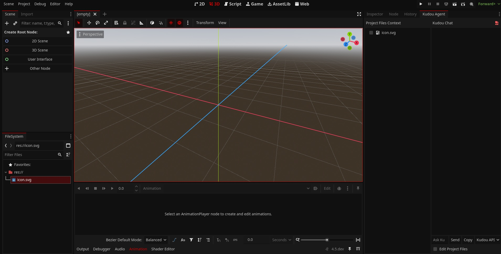

# Kudou Engine

  

  <i>The AI-Powered, Agentic Game Engine</i>

## The power of Godot, supercharged with AI.

**Kudou** is a fork of the incredible **[Godot Engine](https://godotengine.org)**, reimagined to integrate AI solutions and agentic workflows directly into the game development process. Our mission is to make creating games dramatically faster and more accessible by leveraging the power of Large Language Models.

Think of Kudou as a "Cursor for Godot"! It's an intelligent partner that helps you code, design, and create! By connecting to your preferred AI APIs or using web-based tools in the integrated browser, Kudou provides a suite of features to automate tedious tasks, generate code, and offer intelligent assistance, allowing you to focus on your creative vision.

While enhanced with AI, Kudou retains the complete feature set and spirit of Godot. It's the feature-packed, cross-platform game engine you know and love, now supercharged with an AI co-developer.

## Features

Kudou enhances the powerful Godot editor with a suite of seamlessly integrated AI and web tools.

-   **Kudou Agent: Your AI Co-Developer**

    -   A dockable AI assistant providing a chat-based interface for interacting with Large Language Models.
    -   Get help with coding, debugging, and brainstorming ideas without ever leaving the editor.
    -   History is saved in the chat panel, and responses can be easily copied.

-   **Full In-Editor Web Browser**

    -   A complete web browser, powered by the Chromium Embedded Framework, is available as a main screen within the editor.
    -   Look up documentation, browse tutorials, or use your favorite web-based tools like ChatGPT, Gemini, or Perplexity.

-   **True Agentic Workflow**

    -   The Kudou Agent isn't just for chat. With "Edit Project Files" mode enabled, the AI can propose and apply code changes directly to your project files, turning conversation into action and dramatically accelerating your development cycle.

-   **Deep Context Awareness**

    -   Give the AI precise context for your requests. The agent panel includes an interactive file tree that lets you select specific files, directories, and even individual nodes within a scene to include in your prompt. This ensures the AI's responses are highly relevant and accurate.

-   **Flexible LLM Connection**
    -   Connect directly to LLM APIs for a fully integrated experience.
    -   Prefer a different service? The agent can automatically format a context-rich prompt, copy it to your clipboard, and open your preferred AI service (ChatGPT, Claude, etc.) in the integrated browser with a single click.

## Further Development
We plan to integrate the following...
- [x] Web chat and LLM API connector
- [x] Upload files as "context" to speed up development
- [ ] Auto-refactor and parse response to real-time codebase and node changes
- [ ] Auto-prompting for different game development needs
- [ ] MCP support with a prebuilt "Godot" set of agents and tools
- [ ] RAG chatbot for up to the latest documentation
- [ ] Integration of local GENAI and LLM tools for data integrity
- [ ] Game templates to easily start developing your favorite genre fast!
- [ ] Hub to find other Kudou titles
- [ ] Auto-asset conversion into Kudou (converting Unity and Godot assets over)
- [ ] Seamless multiplayer integration and assisted tools

## Getting the Engine

### Binary Downloads

Official binaries for Kudou are not yet available. For now, you will need to compile the engine from source.

### Compiling from source

Kudou uses the same build system as Godot. Please [see the official Godot docs](https://docs.godotengine.org/en/latest/contributing/development/compiling) for compilation instructions for every supported platform.

## Community and Contributing

Kudou is a new and growing project. We are looking for contributors who are passionate about the intersection of AI and game development.

To get started contributing to the project, please see the [contributing guide](CONTRIBUTING.md) and feel free to open an issue or pull request.

## Documentation

Kudou's documentation is currently under development. For engine and API references, the [official Godot documentation](https://docs.godotengine.org) remains the best resource, as Kudou maintains API compatibility.
